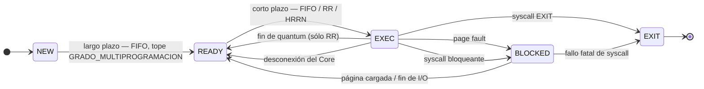

# Diseño del Planificador — estados, PCB y contexto de ejecución

**Issue:** `PLN-06` / `SIS-13`

Diseño sobre papel del modelo de estados y de las estructuras administrativas. **No se implementa
la planificación acá** — eso es el Check 2. Lo único que es código en este issue es el struct del
contexto de ejecución y su serialización, porque viaja por la red y conviene fijarlo mientras el
protocolo todavía se puede cambiar sin romper nada.

**Fuentes:** el enunciado del TP es la fuente de verdad absoluta. El *Resumen SO* de la cátedra se
usa para la nomenclatura teórica (PCB, planificadores, estados).

---

## 1. El modelo de 5 estados

Nombres **textuales del enunciado**: `NEW`, `READY`, `EXEC`, `BLOCKED`, `EXIT`.

### Las transiciones, una por una

| Transición        | Quién la decide  | Disparador                                                                                                                 |
| ----------------- | ---------------- | -------------------------------------------------------------------------------------------------------------------------- |
| `NEW → READY`     | **Largo plazo**  | Hay lugar según `GRADO_MULTIPROGRAMACION`. Siempre **FIFO**, no es configurable                                            |
| `READY → EXEC`    | **Corto plazo**  | Se liberó un Core. El algoritmo (`FIFO`/`RR`/`HRRN`) decide **a quién**                                                    |
| `EXEC → READY`    | Corto plazo (RR) | Fin de quantum: el Planificador manda una interrupción por el canal dedicado                                               |
| `EXEC → READY`    | Un evento        | **Se desconectó el Core**. Además hay que pedirle a la Placa el deslockeo de las páginas del Job                           |
| `EXEC → BLOCKED`  | Un evento        | Page fault, o syscall bloqueante (`LOAD_BATCH`, `LABEL`, `REPORT`, y las 3 de checkpoint)                                  |
| `BLOCKED → READY` | Un evento        | La Placa cargó la página, o el servicio de I/O terminó. **Después del deslockeo**                                          |
| `EXEC → EXIT`     | **Largo plazo**  | La syscall `EXIT`, o un error fatal                                                                                        |
| `BLOCKED → EXIT`  | **Largo plazo**  | Una syscall bloqueante falló de forma fatal: `SAVE_CHECKPOINT` sin espacio, `LOAD_CHECKPOINT` de un checkpoint inexistente |

**Los planificadores actúan sobre transiciones, no sobre estados.** Es la formulación precisa: no
es que "NEW es de largo plazo", es que la **admisión** y la **finalización** las maneja el largo
plazo, y el **despacho** lo maneja el corto plazo. Las transiciones hacia y desde `BLOCKED` no las
planifica nadie: las dispara un evento externo.

### El algoritmo no cambia el grafo

El grafo es **siempre el mismo**. Lo que cambia el algoritmo es:

1. **A quién se elige** de la cola `READY`: FIFO toma el primero; HRRN calcula el *response ratio*
  de cada uno y toma el mayor.
2. **Si la transición** `EXEC → READY` **por quantum se usa o no.** `RR` es el **único con desalojo**.
  Con FIFO y HRRN un Job sólo sale de `EXEC` por bloqueo, por finalización o porque se cayó el Core.

El algoritmo es una **política de selección**, no una topología distinta.

---

## 2. La estructura administrativa del Job: es una **PCB**

Un Job de este TP **no comparte memoria con otros Jobs**: tiene su propia tabla de páginas en la  
Placa y su propio espacio de direcciones lógicas. Eso lo hace análogo a un **proceso**, no a un  
hilo. Por lo tanto la estructura es una PCB.

**Nombre sugerido para el struct:** `t_pcb`. 

### Mapeo: PCB de la teoría → PCB de EntrenadOS

| Campo del PCB (Resumen SO)              | En este TP                                                                                                                                                   |
| --------------------------------------- | ------------------------------------------------------------------------------------------------------------------------------------------------------------ |
| **PSW** — estado del proceso            | `t_estado estado` — uno de los 5                                                                                                                             |
| **PID**                                 | `uint32_t jid`. El Job inicial es el **JID 0**                                                                                                               |
| **PPID, UID**                           | **No aplican.** No hay jerarquía de procesos ni usuarios. `INIT_JOB` crea un Job nuevo, pero el enunciado no define relación padre-hijo ni pide nada de ella |
| **IP/PC + registros del procesador**    | El **contexto de ejecución**: los 14 registros. Ver sección 3                                                                                                |
| **Información de planificación de CPU** | Estimación de la próxima ráfaga y timestamp de llegada a `READY` (para HRRN)                                                                                 |
| **Información de manejo de memoria**    | **Sólo el** `jid`**.** La tabla de páginas vive en la **Placa**, no acá — ver la nota de abajo                                                               |
| **Información de E/S**                  | Qué syscall o servicio lo tiene bloqueado, para saber a dónde devolverlo                                                                                     |
| **Información contable**                | Las **7 estadísticas** obligatorias. Ver sección 4                                                                                                           |

> **La PCB del Planificador no tiene la tabla de páginas.** El enunciado se la asigna a la Placa
> (*"una tabla de páginas por Job"*), y el Planificador se comunica con ella pasándole el `jid` como
> clave. Es una diferencia real con el PCB de la teoría —donde toda la información de memoria vive
> en la misma estructura— y sale de que este es un sistema **distribuido**: cada módulo guarda lo suyo.

### Los campos, agrupados

**Identificación y estado**

- `jid` — identificador único.
- `estado` — el estado actual, de un enum con los 5 nombres del enunciado.
- `archivo_pseudocodigo` — el nombre del archivo de instrucciones. La Placa lo necesita al crear el
Job, relativo a su `PATH_INSTRUCCIONES`.

**Ejecución**

- `contexto` — los 14 registros (sección 3).
- `core_asignado` — **cuál Core lo está ejecutando** mientras está en `EXEC`.
Es fácil de pasar por alto y es imprescindible: cuando se cae el Core 2, hay que encontrar el Job
que estaba corriendo ahí para devolverlo a `READY`. Sin este campo hay que recorrer todas las PCB
buscando cuál estaba en ese Core.

**Planificación**

- `estimacion_rafaga` — la estimación de la próxima ráfaga. Arranca en `ESTIMACION_INICIAL` y se
recalcula con media exponencial usando `HRRN_ALFA`.
- `llegada_a_ready` — el instante en que entró a la cola `READY`. HRRN lo necesita para el tiempo de
espera del *response ratio*.
- `inicio_rafaga` — para medir cuánto duró la ráfaga real y realimentar la estimación.

> Estos tres campos existen **aunque el algoritmo configurado sea FIFO**. El algoritmo se elige por
> config y es fijo durante una prueba, pero la estructura es una sola: no se compila distinto según
> el algoritmo.

**I/O**

- `syscall_pendiente` — qué operación lo tiene bloqueado.
- `paginas_lockeadas` o una marca equivalente — para acordarse de pedir el **deslockeo** antes de
pasarlo a `READY`. El enunciado lo exige y es de lo que más fácil se olvida.

**Contabilidad** — las 7 estadísticas, sección 4.

---

## 3. El contexto de ejecución

Los **14 registros del Core**, todos `uint32_t`, inicializados en **0** al crear el Job.
**14 × 4 = 56 bytes.**

| Grupo             | Registros                     | Uso                                                        |
| ----------------- | ----------------------------- | ---------------------------------------------------------- |
| Control           | `PC`                          | Program Counter: número de instrucción **relativo al Job** |
| Punteros          | `P0` `P1` `P2` `P3` `P4` `P5` | Direcciones **lógicas** de memoria                         |
| Propósito general | `AX` `BX` `CX` `DX`           | Numéricos                                                  |
| Entrenamiento     | `E1` `E2` `E3`                | Operandos de `FORWARD` / `BACKWARD` / `UPDATE`             |

Viaja al Core al despacharlo y vuelve actualizado al liberarlo. Es el mensaje que **más veces cruza
la red** en todo el TP y va en los dos sentidos, por eso su serialización se define ahora.

**Reglas:**

- La serialización vive en `utils/`, no en el Planificador: la usan los dos extremos.
- Se serializa **campo por campo** en orden fijo, como todo el resto. No se hace `memcpy` del
struct aunque sean 14 enteros homogéneos: el padding y el orden quedarían implícitos.
- El `PC` avanza `+1` al final de cada ciclo **salvo** que la instrucción lo haya modificado
(`JNZ`), y **no** se actualiza cuando el Job vuelve por page fault.

---

## 4. Las 7 estadísticas

Se imprimen en el log al finalizar el Job. Textual del enunciado:

1. Tiempo **total** de ejecución (desde el inicio hasta su finalización).
2. Tiempo acumulado de **espera** (sólo el estado `READY`).
3. Tiempo acumulado **para ingresar** (sólo el estado `NEW`).
4. **Tamaño máximo** de memoria dinámica ocupada en un momento dado.
5. Cantidad acumulada de **syscalls** solicitadas.
6. Cantidad acumulada de **page faults** generados.
7. Cantidad acumulada de transiciones `READY → EXEC`.

**Por qué se definen ahora y no cuando haga falta:** ninguna se puede reconstruir a posteriori. Son
**acumuladores que se actualizan en la transición**. Si los campos no están desde el principio, en
noviembre se descubre que nunca se midió algo y hay que instrumentar el módulo entero de nuevo.

**Cómo medir el tiempo:** `commons/temporal.h` — un cronómetro por estado, que se arranca y se pausa
en cada transición. Evita inventar aritmética de timestamps a mano.

**De dónde viene cada una:** la 4 y la 6 dependen de eventos que llegan de **otros módulos** —la
Placa informa el page fault, el `ALLOC`/`FREE` mueve la memoria dinámica—, así que el punto de
actualización está en el manejo de esos mensajes, no en el planificador de corto plazo.

> Detalle de la teoría que aplica: *"todas las estructuras menos el PCB se eliminan. El PCB se
> almacena para fines estadísticos/contables"*. Acá pasa lo mismo — la PCB tiene que sobrevivir al
> `EXIT` el tiempo suficiente para imprimir las estadísticas.

---

## 5. Colas y sincronización

Una cola por estado, con `t_queue` o `t_list` de commons:

| Cola      | Quién la toca                                                                                   |
| --------- | ----------------------------------------------------------------------------------------------- |
| `NEW`     | Largo plazo (admisión)                                                                          |
| `READY`   | Largo plazo (entrada), corto plazo (salida)                                                     |
| `EXEC`    | No es una cola: son los Jobs en los Cores. Se puede resolver con el `core_asignado` de cada PCB |
| `BLOCKED` | Los hilos de atención, cuando llega la respuesta de la Placa o del Storage                      |
| `EXIT`    | Largo plazo                                                                                     |

**Cada cola con su mutex**, y toda lectura o escritura bajo él. Los Jobs se mueven entre colas desde
**hilos distintos**: el hilo de atención de un Core lo saca de `EXEC`, el planificador de largo
plazo mete otro en `READY`.

**Regla de orden de adquisición:** si una transición toca dos colas, siempre se toman en el mismo
orden en todo el código. Es lo que evita el deadlock clásico de dos hilos que agarran los mismos dos
mutex en orden distinto. Definirlo ahora, por escrito, es más barato que descubrirlo después.

Además hacen falta semáforos contadores para que el planificador de largo plazo espere a que haya
lugar (`GRADO_MULTIPROGRAMACION`) y el de corto plazo espere a que haya un Core libre — pero eso ya
es implementación del Check 2.

---

## 6. Qué queda para el Check 2

Este documento define **estructuras y transiciones**. No define ni implementa:

- El ciclo de planificación en sí (los hilos de largo y corto plazo).
- Los algoritmos `FIFO`, `RR` y `HRRN`.
- El context switch y el envío del contexto al Core.
- El manejo del quantum y la interrupción por el canal dedicado.

Lo único que se implementa en `PLN-06` es el **struct del contexto de ejecución y su serialización**
en `utils/`, con un round-trip probado Planificador → Core → Planificador.